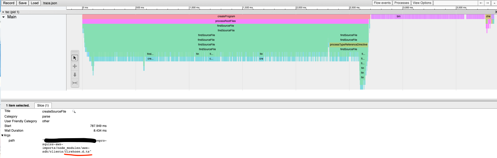
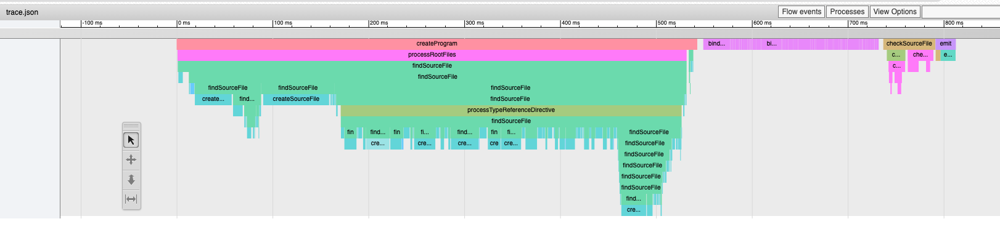

# repro-squiss-aws-imports
Example to trace aws-sdk imports inside squiss-ts library

## Important note about the modified version
A modified version was installed using a tarball hosted in s3 (download [here](https://npm-tarballs-for-prs.s3.amazonaws.com/squiss-ts-4.3.0.tgz)) compiled from a [fork](https://github.com/Raiszo/squiss-ts/tree/better-aws-sdk-imports).

To make them work along upstream version was installed using an alias.
```json
  "dependencies": {
    "squiss-ts": "https://npm-tarballs-for-prs.s3.amazonaws.com/squiss-ts-4.3.0.tgz",
    "upstream-squiss-ts": "npm:squiss-ts@^4.3.0"
  },
```

## Get and view traces
To get traces install dependencies and run `npm run performance` which will create 2 folders:
- `performance-upstream` trace using 4.3.0 squiss-ts version.
- `performance-modified` trace using a modified version of the library that imports specific modules from the aws-sdk.

To view traces navigate to [chrome::tracing]() and load the `trace.json` file, as suggested [here](https://github.com/microsoft/TypeScript/wiki/Performance-Tracing).

### Images
#### upstrem version
`typescript` spends most of the first 2.5 seconds "creating source files" for a lot of aws-sdk definitions that are not used by squiss-ts.


#### patched version
By changing
```typescript
export {SQS, S3} from 'aws-sdk';
```
to
```typescript
import * as SQS from 'aws-sdk/clients/sqs'
export {SQS}
import * as S3 from 'aws-sdk/clients/s3'
export {S3}
```
In places where it will affect the final `.d.ts` files.
The compilation time decreases by a lot, from ~4 s to ~1 s


